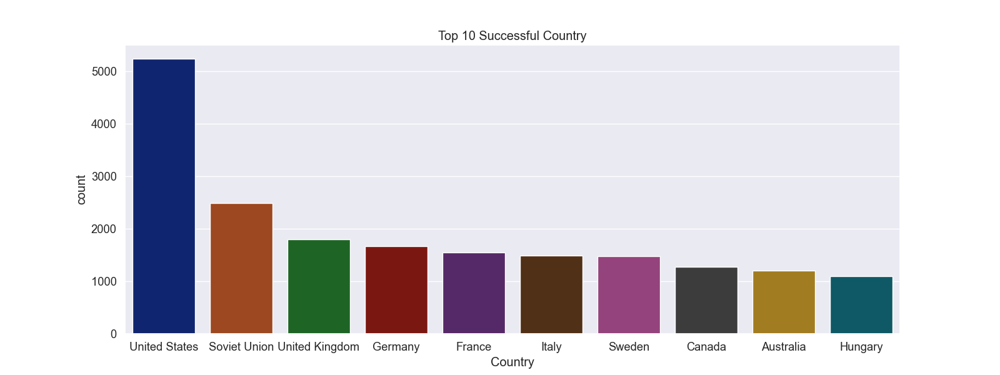
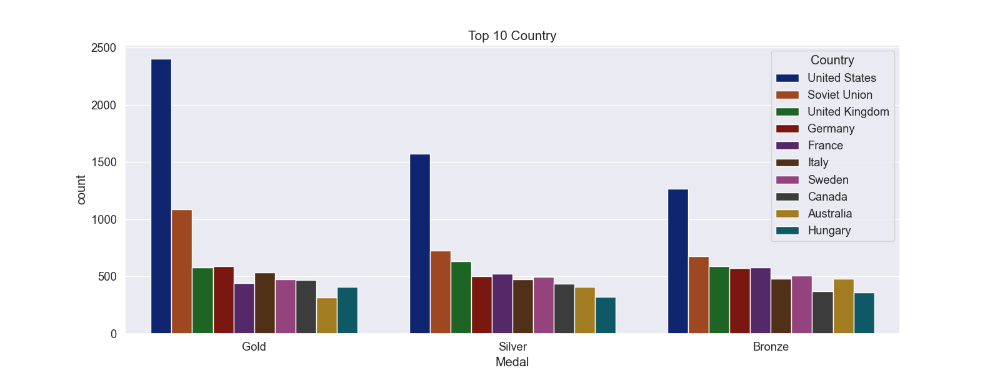
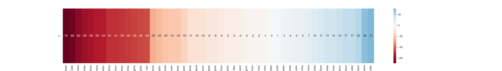
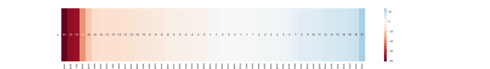

# Olympic Data Analysis: Decoding the Medal Games 🏅📊

Welcome to my Olympic data analysis project, where I've delved deep into the fascinating realm of the Olympics. This project aims to provide a comprehensive understanding of the factors contributing to Olympic success, as measured by medal counts in relation to economic and demographic indicators.

## Project Overview

### 1️⃣ Data Importation

We began by importing three critical CSV datasets representing Summer, Winter, and a reference dictionary. Merging the Summer and Winter datasets, we introduced a new 'Edition' column to distinguish between the games.

### 2️⃣ Null Value Management and Data Cleaning

Ensuring data integrity, we addressed missing entries in the 'code' column and filled in missing country data using mapping functions.

### 3️⃣ Data Merging and Population Analysis

We combined the main dataset with the dictionary, cross-referencing populations and GDP per capita for each country.

### 4️⃣ Handling Missing Values Post-Merge

To enrich our dataset, we retrieved additional data for countries lacking population and GDP information using a chatGPT and Google Bard.

### 5️⃣ Data Enrichment

Leveraging artificial intelligence and meticulous research, we augmented missing values to enhance dataset completeness.

### 6️⃣ Final Data Cleaning

Focused on recognized countries, we excluded teams not affiliated with the National Olympic Committee (NOC) and 'mixed teams.'

### 7️⃣ Visualization and Analysis

We identified and visually presented the top 10 countries by medal count, distinguishing between Summer and Winter Editions. We compared top-performing countries, spotlighting medal tallies.

### 8️⃣ Research Question and Correlation Analysis

Delving deep, we explored the correlation between GDP, population, and medal count, validating hypotheses through statistical models.

## Explore the Project

Explore the full project and its findings:

- [Google Colab](https://lnkd.in/gsPhBsGq)
- [GitHub](https://lnkd.in/gbTeCy5R)

Feel free to dive into the project and discover the insights into Olympic success. Your feedback and thoughts are greatly appreciated! 🥇🌍 #DataAnalysis #Olympics #DataScience #MedalGames
## Top 10 Countries by Medal Count

### Top 10 country By Medal (Gold,Silver,Bronze)

## Edition Matters

The edition of the Olympics can have a significant impact on the results. Factors like the addition of new sports, changes in rules, and geopolitical events can influence medal counts.

## Gender Matters

Gender equality in the Olympics has been a growing concern. The inclusion of more women's events and efforts to promote gender balance have shaped the competition over the years.

